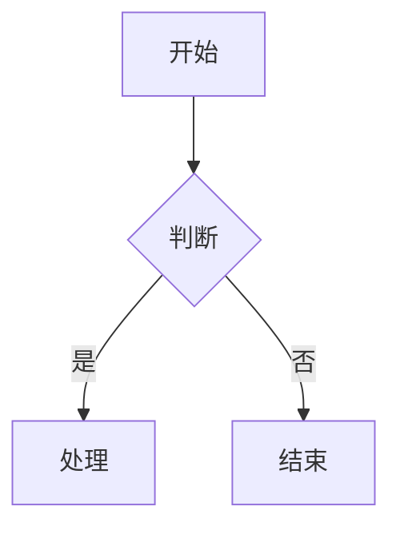
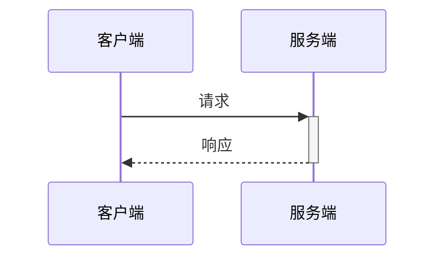
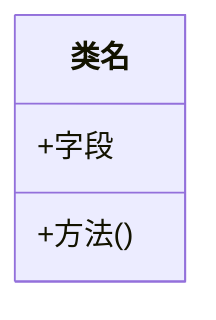

# Wiki 生成器

专业的技术文档自动生成工具，用于创建全面准确的项目 Wiki 文档。

## 触发场景

**立即激活当用户说：**
- "生成XXX的wiki" / "为XXX创建wiki" / "帮我写XXX的wiki"
- "生成XXX文档" / "写XXX的文档" / "创建XXX的技术文档"
- "记录XXX" / "编写XXX说明" / "说明XXX功能"
- "生成资产单状态回调wiki"（示例）
- "生成API文档" / "生成接口文档"

## 工作流程

### 步骤 1: 自动识别相关文件

**立即执行：**
1. 使用 Grep/Glob 工具搜索与主题相关的源文件
2. 至少找到 5 个相关文件，包括：
   - 核心业务逻辑（Service/Controller/Handler）
   - 数据模型（Entity/Model/DTO）
   - 接口定义（API/Interface）
   - 配置文件
   - 现有文档（如有）

3. 直接告诉用户："我找到了以下与【主题】相关的文件，准备生成wiki：" + 文件列表

### 步骤 2: 快速生成 Wiki 文档

**立即开始生成，遵循以下结构：**

```markdown
<details>
<summary>相关源文件</summary>

以下文件被用作生成此 Wiki 页面的上下文：
- 文件1路径
- 文件2路径
...（至少5个）
</details>

# ${主题标题}

## 概述
（1-2段简介，说明功能/模块的目的和作用）

## 核心架构

\`\`\`mermaid
graph TD
    A[组件A] --> B[组件B]
    B --> C[组件C]
\`\`\`

Sources: [文件路径:行号](/文件路径)

## 核心流程

\`\`\`mermaid
sequenceDiagram
    participant A
    participant B

    A->>+B: 请求
    B-->>-A: 响应
\`\`\`

Sources: [文件路径:行号](/文件路径)

## 数据结构

| 字段 | 类型 | 说明 |
|-----|------|------|
| ... | ... | ... |

Sources: [文件路径:行号](/文件路径)

## 关键实现

### 功能点1

（说明具体实现逻辑）

\`\`\`java
// 关键代码片段
\`\`\`

Sources: [文件路径:行号](/文件路径)

## API接口

| 接口 | 方法 | 参数 | 返回值 | 说明 |
|-----|------|------|--------|------|
| ... | ... | ... | ... | ... |

Sources: [文件路径:行号](/文件路径)
```

### 步骤 3: 保存文档

将生成的文档保存到：`docs/wiki/【主题名称】.md`

## 关键要求

1. **中文输出** - 所有内容必须使用中文
2. **源码引用** - 每个重要信息都必须标注来源文件和行号
3. **至少5个源文件** - 确保文档全面
4. **垂直图表** - Mermaid图表必须使用 `graph TD`（自上而下），禁止 `graph LR`
5. **真实内容** - 只基于实际源代码，不编造信息
6. **立即开始** - 无需询问，直接开始文件搜索和文档生成

## Mermaid 图表规范

### 流程图


### 序列图


### 类图


## 快速示例

**用户请求：** "生成订单处理的wiki"

**你的行动：**
1. 立即搜索：`Order`, `订单`, `处理`, `Process` 相关文件
2. 找到 5+ 个文件（OrderService.java, OrderController.java, Order.java等）
3. 告诉用户："我找到了以下与【订单处理】相关的文件，准备生成wiki：..."
4. 立即生成包含架构图、流程图、数据结构的完整文档
5. 保存到 `docs/wiki/订单处理.md`

## 注意事项

- ✅ 直接开始，无需过多确认
- ✅ 使用工具主动搜索文件
- ✅ 所有图表垂直布局
- ✅ 每个信息都有源码引用
- ❌ 不要编造不存在的代码
- ❌ 不要使用横向图表
- ❌ 不要遗漏源码引用
